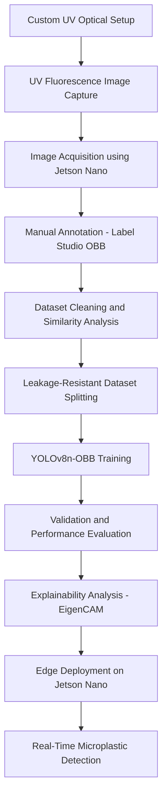

# UV Fluorescence Microplastics Detection

>A low-cost, portable, and explainable AI framework for real-time microplastic detection using UV-induced fluorescence imaging and YOLOv8 Oriented Bounding Box (OBB) detection, designed for deployment on NVIDIA Jetson Nano edge hardware.

---

##  Overview

Microplastic pollution in aquatic ecosystems has become a major environmental and public health challenge. Traditional laboratory techniques such as FTIR spectroscopy, Raman spectroscopy, and chemical staining methods provide high analytical accuracy but require expensive instrumentation, laboratory infrastructure, expert operation, and extensive sample preparation.

This project proposes a low-cost and field-deployable alternative that combines:

UV-induced natural fluorescence imaging
Cross-polarized optical imaging
Deep learning-based oriented object detection
Explainable AI (XAI)
Edge AI deployment

The framework enables real-time localization of microplastic particles in controlled microscopy environments without requiring chemical dyes or staining procedures.

---

##  Contributers 
Kashish
Nadeem 
Manik 
Pahul 
---

##  Hardware Setup

| Component | Purpose |
|-----------|---------|
| UV Light Source | Induces fluorescence in microplastics |
| Polarizer Filter | Eliminates UV glare, improves contrast |
| Camera Module | Captures fluorescence images |
| Acrylic Sample Chamber | Holds water samples |
| Jetson Nano | Edge computing platform |
| Dark Box | Eliminates ambient light interference |

---

# Key Features

- ✅ UV fluorescence-based microplastic visualization
- ✅ Dye-free detection pipeline
- ✅ Custom-built optical imaging chamber
- ✅ YOLOv8 Oriented Bounding Box (OBB) detection
- ✅ Explainable AI using EigenCAM / Grad-CAM
- ✅ Leakage-resistant dataset engineering
- ✅ Similarity-aware dataset splitting
- ✅ Real-time inference on Jetson Nano
- ✅ Low-cost and portable design

---

##  Dataset

| Property | Details |
|----------|---------|
| Total Images | 1,850 |
| Microplastic Classes | 5 (1mm, 2mm, 3mm, 4mm, 5mm) |
| Non-plastic Class | 1 |
| Annotation Tool | Label Studio |
| Annotation Type | Oriented Bounding Box (OBB) |
| Dataset Origin | **Entirely original — built from scratch** |

>  This dataset does not exist anywhere else. 
> It was designed, collected, and annotated specifically for this research.
> To improve scientific reliability, perceptual hash-based similarity analysis was used to reduce duplicate leakage between train, validation, and test splits.
---

##  Model

| Property          | Details                         |
| ----------------- | ------------------------------- |
| Architecture      | YOLOv8n-OBB                     |
| Detection Type    | Oriented Bounding Box Detection |
| Input Resolution  | 640 × 640                       |
| Framework         | Ultralytics YOLOv8              |
| Training Hardware | Apple Silicon (M4)              |
| Deployment Target | NVIDIA Jetson Nano              |

---

## Results (Final Model single classification)

| Metric        | Score      |
| ------------- | -----------|
| Precision     | 97.7%      |
| Recall        | 100%       |
| mAP@50        | 99.1%      |
| mAP@50-95     | 96.7%      |
| Best Epoch    | 84         |
| Training Time | ~2.44 Hours|

The final model was trained after:

Dataset : 1792 images
duplicate removal,
similarity-aware splitting,
inclusion of negative/background samples,
leakage-resistant evaluation.

---

## Explainable AI (XAI)

To improve interpretability and scientific trustworthiness, CAM-based explainability analysis was integrated into the framework using EigenCAM / Grad-CAM.

The explainability pipeline visualizes:

fluorescence-sensitive regions,
particle boundary attention,
model activation behavior,
regions influencing predictions.

Activation maps demonstrated that the model primarily focuses on UV-fluorescent particle regions and structurally meaningful features instead of irrelevant background regions.

---

## Pipeline

---
# Current Status

## Completed

- ✅ UV fluorescence imaging setup
- ✅ Custom dataset creation
- ✅ YOLOv8 OBB detection
- ✅ Leakage-resistant evaluation
- ✅ Explainable AI integration
- ✅ Edge deployment pipeline

---

## In Progress

- 🚧 Multi-class size classification (1mm–5mm)
- 🚧 Automated particle size estimation
- 🚧 Real-world environmental testing

---

##  Paper

Journal paper currently in preparation.
Supervised by **Dr. Sachin Kansal**

---

##  Author

**Kashish Goyal**
2nd Year CSE Undergraduate
- LinkedIn: linkedin.com/in/kashishgoyal111
- LeetCode: leetcode.com/u/kashish1111
- GitHub: github.com/kaashish1111

---
⭐  Star this repo if you find it useful!
